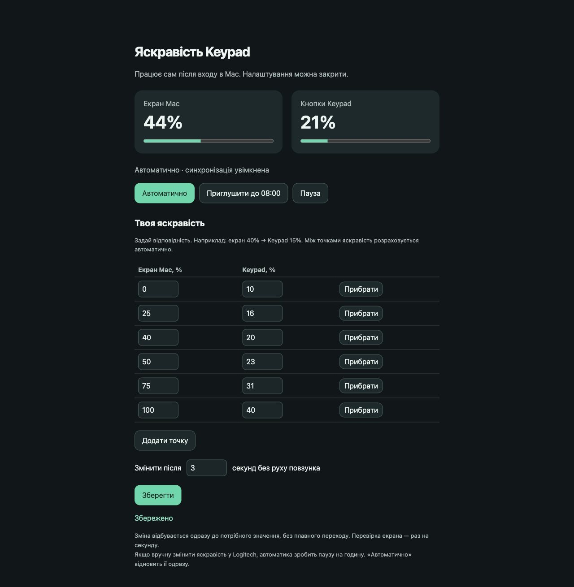

# Keypad Brightness

Автоматична яскравість для **Logitech MX Keypad на Mac**. Вдень кнопки яскравіші, ввечері — приглушені: програма орієнтується на яскравість вбудованого екрана.

Працює після входу в Mac, без іконки в Dock чи меню. Панель налаштувань відкривається лише коли потрібна.



## Як користуватися

Натисни **⌘Space**, введи **«Яскравість Keypad»** і натисни Enter. Або відкрий [локальну панель](http://127.0.0.1:57973/). Ця адреса працює тільки на Mac, де встановлена програма.

У панелі видно фактичну яскравість екрана та кнопок. Є три режими:

| Режим | Що робить |
| --- | --- |
| **Автоматично** | Підлаштовує Keypad під екран. |
| **Приглушити до 08:00** | Залишає мінімальну яскравість до найближчих 08:00, потім повертає автоматичний режим. |
| **Пауза** | Припиняє автоматичні зміни й залишає поточну яскравість. |

Закриття панелі не зупиняє програму.

## Підлаштуй під себе

Таблиця **«Твоя яскравість»** редагується. Наприклад, задай **екран 40% → Keypad 15%** і натисни **«Зберегти»**. Можна додавати та прибирати точки; точки для екрана 0% і 100% мають залишитися.

Між точками програма розраховує проміжні значення. Початкові налаштування:

| Екран Mac | Keypad |
| --- | --- |
| 0% | 10% |
| 25% | 16% |
| 40% | 20% |
| 50% | 23% |
| 75% | 31% |
| 100% | 40% |

Після зміни яскравості екрана програма чекає **3 секунди без нової зміни**, а потім одразу встановлює потрібне значення на Keypad. Якщо рухати повзунок далі, відлік починається знову. Екран перевіряється раз на секунду, тому реакція зазвичай займає 3–4 секунди. Затримку можна змінити в панелі від 0 до 10 секунд.

Ручна зміна яскравості в Logitech призупиняє синхронізацію на годину. Натисни **«Автоматично»**, щоб відновити її одразу.

## Встановлення

Потрібні macOS, підключений MX Keypad, запущені фонові компоненти **Logi Options+**, **Node.js 20+**, Python 3 та інструменти командного рядка Xcode зі Swift-компілятором.

У папці репозиторію виконай:

```sh
python3 install.py
```

Інсталятор збере застосунок і налаштує автоматичний запуск для поточного користувача. Повторний запуск оновлює програму, зберігаючи власну таблицю яскравості.

| Що | Де |
| --- | --- |
| Програма | `~/Applications/Яскравість Keypad.app` |
| Налаштування та стан | `~/Library/Application Support/KeypadBrightness` |
| Автозапуск | `~/Library/LaunchAgents/local.keypad-brightness.plist` |

Код можна зберігати в будь-якій папці, зокрема в iCloud Drive. Встановлена програма працює незалежно від репозиторію. Node.js виконує її у фоні; окремо відкривати Node.js не потрібно.

## Обмеження

- Читає яскравість основного екрана. Перевірено на вбудованому екрані MacBook Pro; зовнішні дисплеї не перевірені.
- Якщо екран спить або Logitech недоступний, чекає відновлення зв’язку.
- Використовує внутрішній локальний інтерфейс Logitech і DisplayServices macOS. Оновлення Logitech або macOS можуть потребувати адаптації. Це незалежний проєкт, а не офіційний застосунок Logitech.

## Приватність

Програма читає лише яскравість екрана та параметр підсвічування Logitech. Не читає натискання клавіш чи паролі, не використовує AI-акаунти та не надсилає дані зовнішнім сервісам.

Панель слухає тільки `127.0.0.1`. Запити на зміну налаштувань перевіряються за адресою джерела та випадковим токеном, який створюється при кожному запуску. Це локальний захист панелі, а не збережений секрет чи API-ключ.

## Видалення

```sh
python3 uninstall.py
```

Прибирає програму та автозапуск. Keypad зберігає поточну яскравість; власні налаштування залишаються для можливого повторного встановлення.

## Перевірка коду

```sh
node --test test/calibration.test.mjs
```

`helper.mjs` керує синхронізацією й локальною панеллю, `brightness.mjs` перевіряє таблицю та розраховує значення, `logi-client.mjs` зв’язується з Logitech, `display-brightness.py` читає екран.

У `lib/ws` включено бібліотеку WebSocket `ws` разом з її ліцензією. Репозиторій містить вихідний код і типові налаштування; поточний стан та журнали до Git не потрапляють.
